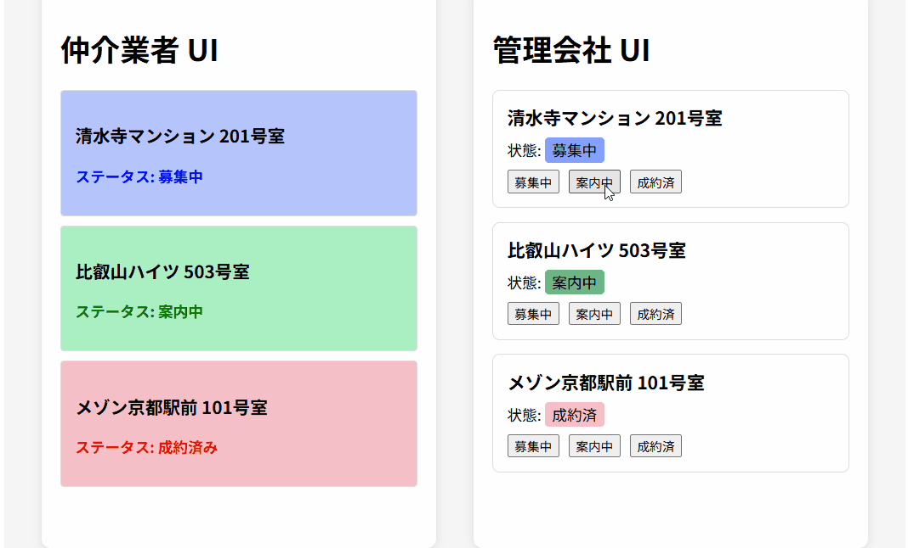

# 不動産 リアルタイム通知システム

不動産の管理会社と仲介業者との間で、物件の空室状況をリロードなしで即座に共有するためのWebアプリです。

## 制作経緯
 私は前職で不動産仲介業に従事していました。その際、電話やメールによる空室確認ではタイムラグがあり、成約済みの物件をご紹介してしまったり、僅差で申し込みを逃したりすることがありました。
 お客様が悲しい思いをされ、従業員の努力も徒労に終わってしまった経験があるため、練習として作成しました。

## 使用技術
* **フロントエンド**: React, TypeScript
* **バックエンド**: Python, FastAPI
* **リアルタイム通信**: WebSocket

## 技術選定理由
### フロントエンド
* **React**: 頻繁に変動する物件状況を、リロードなしで即座に画面へ反映させるため採用しました。
* **TypeScript**: 現場での運用を見据え、サーバーから届くデータの型を定義することで、表示の不整合やバグを未然に防いでいます。

### バックエンド
* **FastAPI**: 複数クライアントからの常時接続を捌くのが得意であることや、WebSocketとの相性の良さで選定しました。

## 動作確認
開発環境で、以下の動作を手動テストしました。

*  
  複数の異なるブラウザを同時に立ち上げ、片方での変更がもう一方のブラウザ画面へ即時反映されること。  
* 連続して物件ステータスのボタンを押しても、データに問題がないこと。
* ネットを切断しても、不正なデータ更新が行われないこと。

>テストに関しては、理解できていない部分が多いため、今後の学習の課題としたいです。

